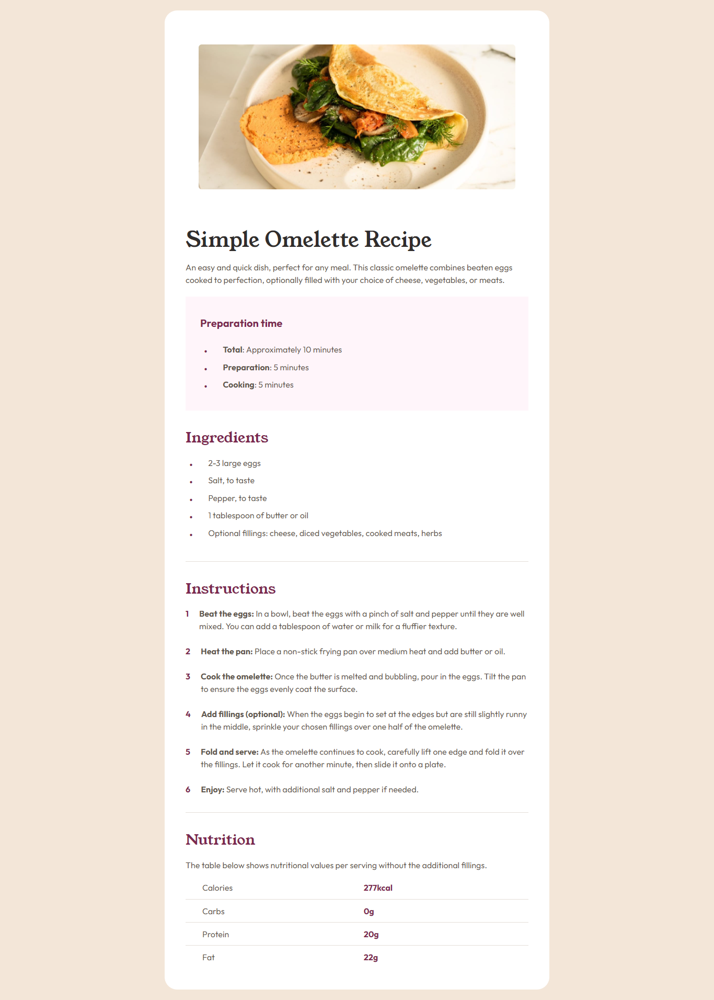

# Frontend Mentor - Recipe page solution

This is a solution to the [Recipe page challenge on Frontend Mentor](https://www.frontendmentor.io/challenges/recipe-page-KiTsR8QQKm). Frontend Mentor challenges help you improve your coding skills by building realistic projects.

## Table of contents

- [Overview](#overview)
  - [Screenshot](#screenshot)
  - [Links](#links)
- [My process](#my-process)
  - [Built with](#built-with)
  - [What I learned](#what-i-learned)
  - [Continued development](#continued-development)
  - [Useful resources](#useful-resources)
- [Author](#author)
- [Acknowledgments](#acknowledgments)

## Overview

### Screenshot

### Links

- Solution URL: [Solution URL](https://github.com/AvinashKumarMahato/simple-receipe-landing-page)
- Live Site URL: [Live URL](https://avinashkumarmahato.github.io/simple-receipe-landing-page/)

## My process

### Built with

- Semantic HTML5 markup
- CSS custom properties
- Flexbox
- Mobile-first workflow

### What I learned

During this project, I learned the importance of a mobile-first approach and how to effectively use Flexbox for layout management. Additionally, I improved my skills in creating responsive designs that adapt well to different screen sizes.

## Continued development
In future projects, I plan to continue focusing on responsive design and improving my use of CSS Grid for more complex layouts. I also want to deepen my understanding of accessibility best practices to ensure my sites are usable for everyone.

## Useful resources
[ MDN Web Docs ](https://developer.mozilla.org/en-US/)- This is a comprehensive resource for web development documentation and learning.

[ CSS-Tricks ](https://css-tricks.com/) - This site offers a plethora of articles and guides on CSS and web design.
## Acknowledgements
Thanks to the Frontend Mentor community for providing feedback and support throughout this project.

